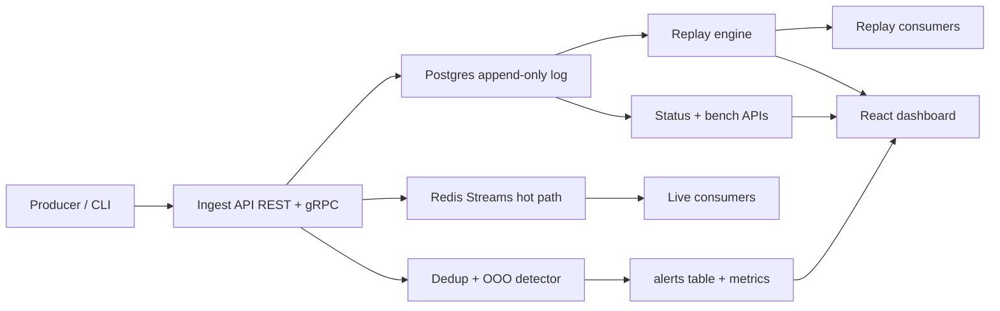

# Chronicle Architecture

Chronicle is an ordered, append-only event log with correctness checks and variable-speed replay. It is designed as a small, production-shaped system: durable log first, hot fan-out second, replay as a first-class API.

## Goals

- **Durability:** every accepted event is assigned a per-stream sequence number in Postgres before side effects.
- **Correctness visibility:** duplicates and out-of-order arrivals are detected, counted, and alerted — not silently dropped (except duplicate identity, which is idempotent).
- **Replay:** consumers can time-travel a stream from `T1` to `T2` at `1x` / `10x` / `100x` / `max` without inventing new identities.
- **Operability:** HTTP + gRPC ingest, Prometheus metrics, CLI, and a dashboard for lag / throughput / replay / benches.

## High-level data path

## Durability model

| Store | Role |
|-------|------|
| **Postgres** | Source of truth. Append-only `events` keyed by `(stream_id, seq)` with unique `(stream_id, event_id)`. |
| **Redis Streams** | Hot fan-out for live consumers. Approximate maxlen trim. Not used for replay correctness. |

Ingest transaction (simplified):

1. `INSERT` stream row if missing.
2. Lock stream watermark (`FOR UPDATE`).
3. If `(stream_id, event_id)` exists → treat as **duplicate**: bump counter, write alert, return existing `seq` (idempotent ack).
4. Else assign `seq = latest_seq + 1`, evaluate out-of-order vs watermark, insert event, update stream stats.
5. After commit, `XADD` to Redis for newly accepted events only.

## Correctness rules

- **Duplicate:** same producer `event_id` on a stream after first accept. Response is idempotent (`duplicate: true`, same `seq`). Alert type `duplicate`.
- **Out-of-order:** `event_time` strictly earlier than the stream's watermark (`latest_event_time`). Event is still stored with `out_of_order = true`. Alert type `out_of_order`. Watermark does not move backwards.

These rules live in `chronicle-core` so the server and tests share one definition of truth.

## Replay guarantees

- Replay **reads Postgres** filtered by `[from, to]` ordered by `(event_time ASC, seq ASC)`.
- Pacing uses original inter-event gaps divided by speed factor (`1x` / `10x` / `100x`). `max` sleeps zero (benchmark / catch-up).
- Published replay records keep the original `seq` and `event_id`. Stream key is namespaced as `replay:{stream_id}` so live consumer groups are not polluted.
- Status is persisted in `replays` and exposed via `GET /v1/replays/{id}`.

## API surface

| Interface | Purpose |
|-----------|---------|
| `POST /v1/streams/{id}/events` | REST ingest |
| gRPC `IngestService.IngestEvent` | Binary ingest parity |
| `POST /v1/replays` | Start replay `{ stream_id, from, to, speed }` |
| `GET /v1/status` | Streams, active replays, alerts, storage bytes, Redis lengths |
| `POST /v1/bench` | Synthetic ingest + max-speed replay sample |
| `GET /metrics` | Prometheus exposition |
| CLI `chronicle ingest\|replay\|status` | Operator workflow |

## Failure isolation

- Durable write succeeds even if Redis publish fails (warn + continue). Live lag may temporarily diverge; the log remains correct.
- Replay failures mark the replay row `failed` with an error string; they never mutate historical `events`.

## Why this shape for a portfolio

It mirrors how real streaming platforms separate **commit log**, **fan-out**, and **replay/time-travel**, while keeping the implementation small enough to read in one sitting. The interesting engineering is in sequence assignment under concurrency, idempotency, watermarking, and paced replay — not in framework ceremony.
